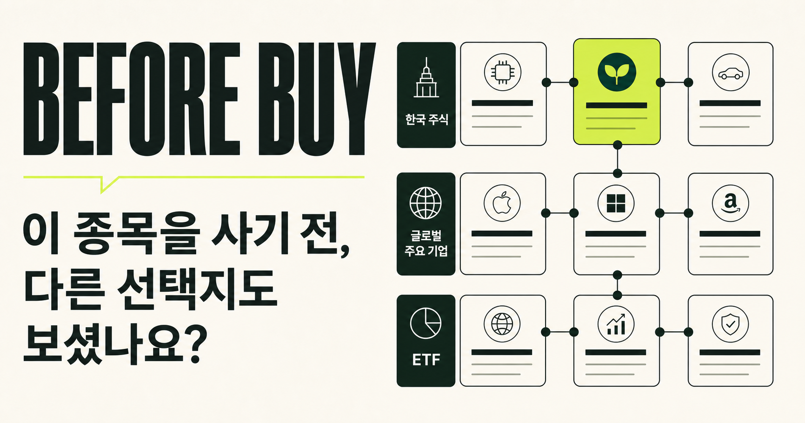
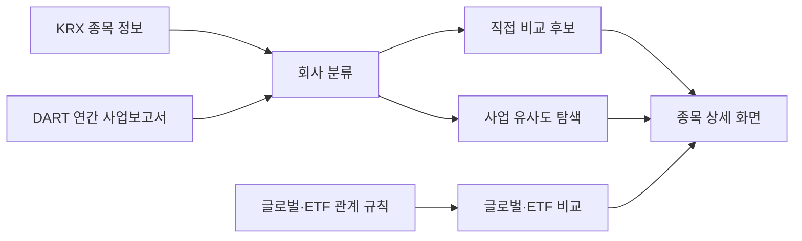

# BEFORE BUY

한국 주식 종목을 보기 전에, **같은 역할의 다른 기업과 ETF를 함께 비교해 보는 서비스**입니다.

관심 종목을 검색하면 국내 직접 비교 기업을 먼저 보여주고, 비교가 가능한 경우 글로벌 기업과 ETF까지 이어서 확인할 수 있습니다. 어떤 대안이든 “왜 비교하는지”와 “무엇이 다른지”를 남기는 데 초점을 둡니다.

> 투자 추천이나 매매 신호 서비스가 아닙니다. 종목을 사기 전 비교할 선택지와 확인할 차이를 정리하는 도구입니다.



## 무엇을 해결하나요?

삼성전자에 관심이 생겼을 때 SK하이닉스, 마이크론, TSMC, 반도체 ETF를 각각 찾아보는 일은 어렵지 않습니다. 다만 이 기업들이 정말 같은 비교 대상인지, 사업 구조와 위험은 어떻게 다른지 한 화면에서 정리하기는 어렵습니다.

BEFORE BUY는 그 비교 과정을 아래처럼 단순하게 만듭니다.

1. 한국 상장 종목을 검색합니다.
2. 같은 사업 역할을 하는 국내 기업을 먼저 봅니다.
3. 글로벌 기업·ETF까지 넓혀 사업 구조, 투자 특성, 위험의 차이를 확인합니다.

## 화면에서 보는 것

| 구분 | 의미 |
| --- | --- |
| 확인된 직접 비교 | 같은 비교 섹터와 주력 사업 역할이 확인된 국내 기업입니다. 예: 메모리 제조사끼리 비교합니다. |
| 사업 유사도 탐색 | 연간 사업 내용·사업 노출·제품이 비슷한 기업을 참고로 보여줍니다. 직접 비교와는 별도입니다. |
| 글로벌 비교 | 사업상 비교 기준이 충분히 확인된 경우에만 글로벌 peer를 연결합니다. |
| ETF 비교 | 개별 기업 노출과 ETF의 분산 구조, 대표 구성 종목을 함께 보여줍니다. |

후보를 억지로 채우지 않습니다. 직접 비교 근거가 부족하면 그 상태를 그대로 표시합니다.

## 비교는 어떻게 만드나요?

LLM이나 유료 AI API를 호출하지 않습니다. 저장된 스냅샷과 규칙 기반 분류를 사용하므로, 같은 데이터에서는 같은 결과를 재현할 수 있습니다.



- **회사 분류:** WICS 대분류를 참고해 서비스 비교 섹터를 정하고, 세부 사업 역할·제품·수요처·실적 변수를 태그로 관리합니다.
- **직접 비교:** 같은 주력 역할을 가진 기업만 연결합니다. 아직 검증하지 않은 역할은 ‘검토 중’으로 남깁니다.
- **유사도 탐색:** DART 연간 사업보고서 텍스트, 사업 노출, 제품, 규모를 결합해 계산합니다. 이는 직접 비교의 순위를 대신하지 않습니다.
- **글로벌·ETF:** 사전에 정의한 사업 관계와 추천 사유가 있는 경우에만 연결합니다.

## 현재 범위

- 한국 상장 종목 검색: KOSPI·KOSDAQ·KONEX 보통주 중심 약 2,800개
- 사업 프로필: DART 연간 사업보고서 기반
- 직접 비교: 역할 규칙이 확인된 국내 기업부터 제공
- 글로벌·ETF: 검증된 섹터·사업 관계에서만 제공
- 미국 자산: 기간 수익률을 원화 환산 수익률과 기준 환율일로 함께 표시

모든 한국 종목을 검색할 수 있지만, 모든 종목에 같은 깊이의 비교 데이터가 있는 것은 아닙니다. 데이터가 부족한 경우에는 가능한 범위와 이유를 화면에 표시합니다.

## 로컬 실행

Node.js 22.13 이상, Python 3.11 이상, [uv](https://docs.astral.sh/uv/)가 필요합니다.

```bash
git clone https://github.com/spark142857142857/BeforeBuy.git
cd BeforeBuy
npm install
uv sync
npm run dev
```

브라우저에서 [http://localhost:3000](http://localhost:3000)을 열면 됩니다. 저장된 스냅샷을 사용하므로, 조회 화면만 확인할 때는 API 키가 필요하지 않습니다.

### DART 데이터를 새로 수집할 때

`.env.local`에 OpenDART 키를 넣습니다. 이 파일은 Git에 포함되지 않습니다.

```dotenv
NEXT_PUBLIC_SITE_URL=http://localhost:3000
DART_API_KEY=your_open_dart_api_key
```

주요 명령어는 아래와 같습니다.

| 명령어 | 용도 |
| --- | --- |
| `npm run data:check` | 스냅샷 구조와 참조 무결성 검사 |
| `npm run data:derive` | 사업 프로필·유사도·분류·직접 비교 후보를 다시 생성 |
| `npm run data:refresh` | KRX·DART 수집부터 파생 데이터 생성까지 전체 갱신 |
| `npm test` | 빌드, 화면·사용 사례·파이프라인 테스트 실행 |
| `npm run lint` | 정적 코드 검사 |

수집·분류 규칙의 자세한 설명은 [pipeline/README.md](./pipeline/README.md)에서 확인할 수 있습니다.

## 기술 구성

- Web: Next.js, React, TypeScript, CSS
- Build: Vinext, Vite, Cloudflare Workers
- Data: FinanceDataReader/KRX, OpenDART, ETF 운용사 공개 자료
- Pipeline: Python, pandas, scikit-learn
- Test: Node test runner, Python unittest, GitHub Actions

## 주의

표시되는 재무·수익률·ETF 구성 데이터는 참고용 스냅샷입니다. 지연이나 오류가 있을 수 있으므로 실제 투자 판단 전에는 거래소, 운용사, 기업 공시의 최신 정보를 다시 확인해야 합니다.
