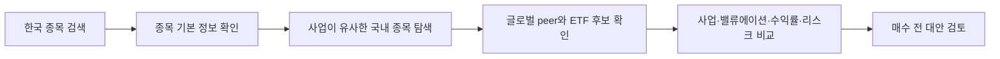
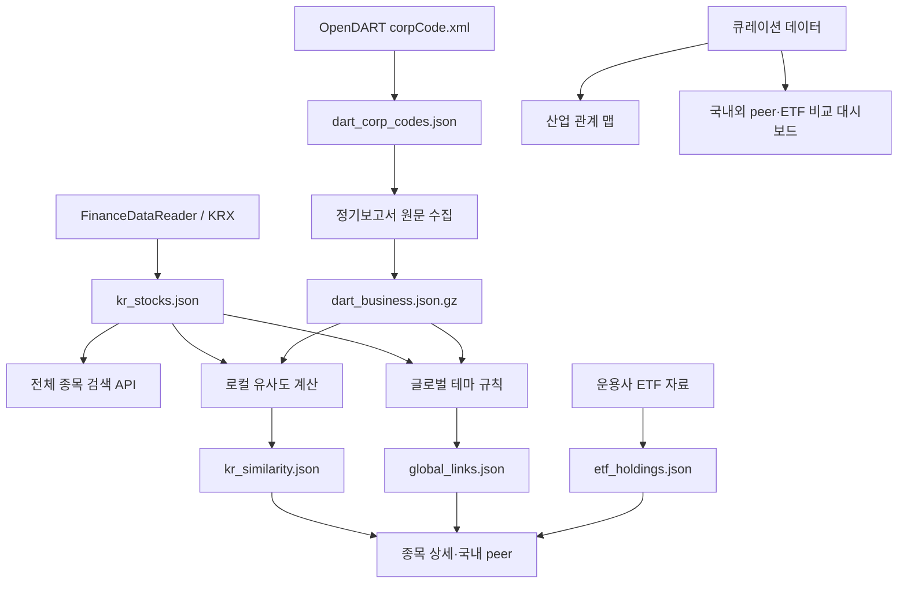

<div align="center">

# BEFORE BUY

### 이 종목을 사기 전, 다른 선택지도 보셨나요?

한국 개별 종목에 관심이 생겼을 때 사업이 닮은 국내외 기업과 ETF를 함께 검토할 수 있도록 돕는<br>
**한국 주식 투자 대안 탐색 서비스**입니다.

<p>
  
  
  
  
  
  
</p>

</div>


## 프로젝트 소개

주식 투자자는 한 종목에 관심이 생기면 보통 해당 기업의 차트와 재무지표부터 확인합니다. 하지만 매수 전에 더 중요한 질문이 남아 있습니다.

> 같은 산업에 속하면서 사업 구조가 더 단순한 기업은 없을까?<br>
> 개별 기업 대신 관련 ETF로 분산할 수는 없을까?<br>
> 국내 종목과 비교할 만한 글로벌 기업은 무엇일까?

BEFORE BUY는 특정 종목의 매수를 추천하거나 매매 신호를 제공하지 않습니다. 관심 종목과 사업적으로 연결되는 대안을 보여주고, 사용자가 직접 차이를 확인하도록 돕는 것이 목적입니다.

### 핵심 설계 원칙

- **사업을 먼저 봅니다.** 주가 상관관계만으로 유사 종목을 판단하지 않습니다.
- **추천 이유를 설명합니다.** 공통 업종, 주요 제품, 사업 노출을 근거로 제시합니다.
- **수익률은 보조 지표입니다.** 성장성, 주주환원, 변동성, 최대 낙폭과 함께 비교합니다.
- **LLM 호출 비용이 없습니다.** 배치 수집 데이터와 로컬 유사도 계산을 사용합니다.
- **매수 신호를 만들지 않습니다.** 투자 판단의 범위를 넓히는 비교 도구입니다.

## 사용자 흐름



1. 종목명 또는 종목코드로 한국 상장 종목을 검색합니다.
2. 시장, 시가총액, 발행주식 수와 같은 기본 정보를 확인합니다.
3. 사업 내용과 업종이 유사한 국내 종목 후보를 확인합니다.
4. 큐레이션된 글로벌 peer와 관련 ETF를 함께 검토합니다.
5. 공통점과 결정 전 확인해야 할 차이를 비교합니다.

## 현재 구현 현황

| 영역 | 상태 | 현재 범위 |
| --- | --- | --- |
| 한국 상장 종목 전체 검색 | ✅ 완료 | KOSPI·KOSDAQ·KONEX 2,822개 |
| KRX 업종·주요 제품 연결 | ✅ 완료 | 업종 2,709개, 주요 제품 2,698개 |
| DART 기업 고유번호 매핑 | ✅ 완료 | 상장 종목 2,709개 매핑 |
| 산업 관계 맵 | ✅ 완료 | 7개 섹터의 기업·ETF 관계 탐색 |
| 고급 비교 대시보드 | ✅ 완료 | 국내외 주식·ETF 48개, 비교 관계 19세트 |
| 미국 자산 원화 수익률 | ✅ 완료 | 환율 기준일과 원화 환산 수익률 표시 |
| DART 연간 사업 내용 수집 | ✅ 완료 | 2,690개 사업 프로필 |
| 로컬 유사 종목 계산기 | ✅ 완료 | 2,599개 기업, 상위 후보 25,990개 |
| 전체 종목 국내 peer 연결 | ✅ 완료 | 사업 프로필과 상위 국내 후보 5개 표시 |
| 전체 종목 글로벌 peer 확장 | ✅ 완료 | 7개 테마 규칙으로 한국 종목 488개 연결 |
| ETF 구성 종목 연결 | ✅ 완료 | 국내외 ETF 14개의 주요 편입 종목·기준일·출처 표시 |
| 개별 종목 vs ETF 비교 | ✅ 완료 | 편입 여부·구성 수·집중 위험·환율·성과 지표 비교 |

> 현재 모든 한국 상장 종목을 검색할 수 있습니다.<br>
> 완성도 높은 비교 대시보드는 우선 큐레이션된 대표 종목에 제공되며, DART 수집과 로컬 유사도 계산을 통해 전체 종목으로 확장하고 있습니다.

## 주요 기능

### 1. 한국 상장 종목 전체 검색

- KOSPI, KOSDAQ, KONEX 통합 검색
- 종목명과 6자리 종목코드 검색
- 종목명, 종목코드, 업종, 주요 제품 기반 검색 순위
- 180ms 디바운스를 적용한 검색 API 호출
- 큐레이션 종목과 전체 마스터 종목의 상세 페이지 분기

### 2. 산업 관계 맵

단순한 주가 상관관계 그래프가 아니라 사용자가 이해하기 쉬운 사업 관계를 사용합니다.

```text
섹터
└── 세부 산업
    ├── 한국 대표 기업
    ├── 글로벌 peer
    └── 관련 ETF
```

현재 반도체, 모빌리티, 2차전지, 플랫폼, 바이오, 산업재, 금융 섹터를 탐색할 수 있습니다.

### 3. 투자 대안 비교 대시보드

관심 종목과 함께 검토할 국내외 기업 및 ETF를 카드와 표로 비교합니다.

- 대안이 선정된 이유
- 사업 요약과 핵심 노출
- 투자 성격
- PER, PBR
- 매출 성장률
- 주주환원율
- 1년 수익률
- 미국 자산의 원화 환산 수익률
- 연환산 변동성
- 최대 낙폭
- 공통점과 결정 전 확인할 차이
- 후보별 주요 위험

사용자는 최대 4개의 대안을 선택해 관심 종목과 나란히 비교할 수 있습니다.

### 4. 전체 종목 기본 상세 페이지

아직 고급 비교 데이터가 연결되지 않은 종목도 별도 상세 URL을 제공합니다.

- 시장 구분
- 종목코드와 ISIN
- 시가총액
- 발행주식 수
- 보통주·우선주·리츠·스팩 구분
- 데이터 파이프라인 연결 상태

### 5. DART 사업 내용 수집 파이프라인

OpenDART의 최신 연간 사업보고서 원문에서 `II. 사업의 내용` 구간을 추출합니다.

- KRX 종목코드와 DART 고유번호 매핑
- 최신 연간 사업보고서 탐색
- 동일 결산기간의 기재정정 보고서 우선
- 분기·반기·첨부정정·첨부추가 보고서 제외
- 원문 또는 사업 섹션이 없을 때 이전 정상 연간 보고서로 후퇴
- 사업 본문이 3,000자 미만이면 낮은 텍스트 신뢰도로 표시
- 공시 원문 ZIP 다운로드 및 본문 정제
- 3개 작업으로 제한한 병렬 수집
- 100개 종목마다 압축 체크포인트 저장
- 중단 후 재실행 시 성공한 종목 건너뛰기
- 오류, 보고서 없음, 섹션 추출 실패 상태 구분
- API 키가 결과 파일에 포함되지 않도록 분리

### 6. 로컬 유사 종목 점수

외부 AI API나 LLM을 호출하지 않고 로컬에서 유사 종목을 계산합니다.

```text
최종 유사도 = 연간 사업보고서 텍스트 유사도 40%
            + 다중 사업 노출 유사도 40%
            + KRX 주요 제품 유사도 10%
            + 기업 규모 유사도 10%
```

- DART 사업 내용과 KRX 주요 제품을 문자 단위 TF-IDF 벡터로 변환
- 한국어 띄어쓰기와 복합 기업 설명에 대응하기 위해 2~5글자 문자 조각 사용
- KRX 단일 업종의 0/1 일치 점수를 사용하지 않음
- 업종·주요 제품·DART 사업 개요에서 51개 다중 사업 노출 태그 추출
- 복합 기업과 순수 사업 기업을 비교하기 위해 포함도 70%와 Jaccard 30%를 결합
- 제품 유사도는 작은 기업에 과도한 1점이 부여되지 않도록 Dice 점수 사용
- 비교 가능한 peer를 우선하도록 시가총액 비율의 완만한 규모 유사도 반영
- 삼성전자·SK하이닉스·현대차·기아는 DART 사업부문을 근거로 검토된 노출 강도 제공
- 공통 사업 노출과 제품 키워드로 추천 이유 생성
- 각 종목에 대해 상위 유사 후보와 점수 구성요소 저장
- 삼성전자↔SK하이닉스, 현대차↔기아, NAVER→카카오 등 대표 회귀 테스트 적용

### 7. 국내외 peer와 관련 ETF 자동 연결

국내 유사도 계산과 글로벌 연결은 목적이 다르므로 별도 계층으로 관리합니다.
글로벌 기업은 전체 시장을 임베딩한 결과가 아니라, 검토 가능한 7개 산업 테마
규칙을 통과한 종목에만 연결합니다.

- KRX 업종, 주요 제품, DART 연간 사업 프로필에서 키워드 근거 추출
- 반도체, 모빌리티, 2차전지, 플랫폼, 헬스케어, 방산, 금융 규칙 제공
- 종목별 최대 2개 테마로 제한
- 부품사처럼 직접 비교할 글로벌 기업이 불명확하면 ETF만 연결
- 매칭 키워드, 규칙 점수, 사람이 읽을 수 있는 추천 이유 표시
- LLM 및 외부 AI API 호출 없음

현재 2,822개 한국 상장 종목 중 근거 기준을 통과한 488개 종목에 글로벌 peer
또는 관련 ETF를 제공합니다. 모든 종목을 억지로 분류하기보다 규칙을 통과하지
못한 종목은 연결하지 않는 방식입니다.

### 8. ETF 주요 구성 종목

관련 ETF 카드와 ETF 상세 페이지에서 운용사 자료의 주요 구성 종목을 확인할 수
있습니다.

- 국내 7개, 미국 7개 ETF
- 대표 상위 구성 종목 5개
- 확인 기준일과 전체 구성 종목 수(확인 가능한 경우)
- 편입 비중(공식 자료에서 확인 가능한 경우)
- 운용사 공식 자료 링크
- 실제 비중이 계속 변한다는 안내

### 9. 개별 종목 vs ETF 직접 비교

관련 ETF가 연결된 한국 종목은 기업 집중 투자와 산업 분산 투자의 차이를 별도
화면에서 확인할 수 있습니다.

- 단일 기업과 ETF 전체 구성 수 비교
- 선택 종목이 ETF 주요 구성에 포함되는지 확인
- 확인 가능한 경우 편입 비중 표시
- 개별 종목의 제품·고객·경영 위험과 ETF의 산업 집중·상위 종목·환율 위험 비교
- ETF 상위 구성 종목 비중 합계 또는 공식 원문 확인 안내
- 대표 큐레이션 종목은 1년 수익률, 변동성, 최대 낙폭 직접 비교
- 전체 종목은 확보되지 않은 재무·시장 지표를 임의로 생성하지 않고 구조 정보만 표시
- 어느 쪽이 더 좋다는 판정 대신 추가로 조사할 조건 제시

## 데이터 흐름



웹 화면은 실시간 외부 API를 직접 호출하지 않고, 로컬 배치가 만든 버전 관리 가능한 스냅샷을 읽습니다. 데이터 공급자를 교체할 수 있도록 수집 계층과 화면 계층을 분리했습니다.

DART 전체 원문 압축 파일은 로컬 배치 캐시로만 사용하며 GitHub에는 포함하지 않습니다. 웹에는 짧은 사업 프로필, 계산된 지표, 상위 유사 후보만 저장합니다.

## 기술 스택

| 구분 | 기술 | 역할 |
| --- | --- | --- |
| Frontend | Next.js 16, React 19, TypeScript | 검색, 산업 맵, 종목 상세, 비교 대시보드 |
| Styling | CSS, responsive layout | 데스크톱·모바일 UI |
| Build | Vinext, Vite | Next.js 애플리케이션 빌드 |
| Data pipeline | Python 3.11+, uv | 데이터 수집과 배치 실행 |
| Korean market data | FinanceDataReader, KRX | 종목 목록, 시가총액, 업종, 주요 제품 |
| Company filings | OpenDART | 기업 고유번호와 정기보고서 사업 내용 |
| Similarity | scikit-learn, TF-IDF, cosine similarity | 비용 없는 로컬 유사 종목 계산 |
| Test | Node test runner, Python unittest | 웹 경로와 데이터 계산 검증 |

## 프로젝트 구조

```text
stock-alternative-explorer/
├── app/
│   ├── api/
│   │   ├── snapshot/          # 스냅샷 상태 API
│   │   └── stocks/search/     # 한국 종목 검색 API
│   ├── stocks/[slug]/         # 종목 상세·비교 대시보드
│   └── page.tsx               # 검색과 산업 관계 맵
├── components/
│   ├── SearchExplorer.tsx
│   └── IndustryMap.tsx
├── data/generated/            # 웹용 스냅샷과 로컬 배치 캐시
├── lib/data/
│   ├── catalog.ts             # 큐레이션 자산과 비교 관계
│   ├── krx-master.ts          # 전체 종목 검색 계층
│   └── providers.ts           # 교체 가능한 시장 데이터 공급자
├── pipeline/
│   ├── collect_krx_master.py  # 한국 상장 종목 마스터
│   ├── collect_dart_business.py
│   ├── dart_client.py
│   ├── build_similarity.py    # 로컬 유사 종목 계산
│   └── build_global_links.py  # 글로벌 peer·ETF 규칙 연결
├── scripts/check-snapshot.mjs
└── tests/
```

## 로컬 실행

### 요구 사항

- Node.js 22.13 이상
- Python 3.11 이상
- [uv](https://docs.astral.sh/uv/)

### 설치 및 웹 실행

```bash
npm install
uv sync
npm run dev
```

웹 화면은 API 키가 없어도 저장된 스냅샷으로 실행됩니다.

### 환경 변수

DART 데이터를 새로 수집할 때만 프로젝트 루트의 `.env.local`에 키가 필요합니다.

```dotenv
DART_API_KEY=your_open_dart_api_key
```

`.env.local`은 Git에서 제외되며 API 키는 생성 데이터에 포함되지 않습니다.

## 데이터 명령어

| 명령어 | 설명 |
| --- | --- |
| `npm run data:krx` | 한국 상장 종목 마스터 갱신 |
| `npm run data:dart:map` | KRX 종목과 DART 기업 고유번호 매핑 |
| `npm run data:dart:sample` | 삼성전자·동화약품·NAVER로 DART 추출 검증 |
| `npm run data:dart` | 전체 DART 사업 내용 수집 또는 이어받기 |
| `npm run data:profiles` | 배포용 경량 사업 프로필과 우선주 연결 생성 |
| `npm run data:similarity` | 전체 로컬 유사 종목 점수 생성 |
| `npm run data:global` | 글로벌 peer와 관련 ETF 규칙 연결 생성 |
| `npm run data:check` | 종목 수, DART 매핑, 큐레이션 데이터 무결성 검사 |

## 테스트

```bash
npm run lint
npm test
```

현재 테스트는 다음을 검증합니다.

- 홈 화면의 한국 종목 검색과 산업 관계 맵
- 큐레이션 외 종목 검색
- 전체 종목 기본 상세 페이지
- 국내외 peer 및 ETF 비교 화면
- 스냅샷 상태 API
- 동일 업종·유사 사업 기업의 우선 추천
- 대표 종목의 글로벌 peer·ETF 규칙 연결
- ETF 주요 구성 종목, 기준일, 공식 출처
- KRX 종목 수, 중복 코드, DART 매핑 무결성

## 로드맵

개발은 아래 순서로 진행합니다.

1. [x] 한국 상장 종목 전체 검색
2. [x] DART 연간 사업 내용 전체 수집 및 품질 검증
3. [x] 로컬 임베딩과 업종 기반 유사 종목 점수 전체 생성
4. [x] 전체 한국 종목에 자동 국내 peer 연결
5. [x] 전체 종목의 글로벌 peer 비교 확장
6. [x] 관련 ETF 연결 및 주요 구성 종목 표시
7. [x] 개별 종목과 ETF 비교 기능 확장
8. [ ] 기능과 데이터 품질이 안정된 이후 웹 배포

### Phase 2: 사업 관계 그래프

핵심 비교 기능과 데이터 품질이 안정된 이후, 종목을 중심으로 관련 기업과 ETF를
거리 기반 그래프로 탐색하는 기능을 검토합니다.

- 중심 노드: 사용자가 입력한 한국 종목
- 거리 기준: 사업 유사도, 공통 제품, 공급망 역할, ETF 동시 편입
- 노드 구분: 한국 기업, 글로벌 기업, ETF
- 간선 구분: 직접 peer, 공급망, 같은 산업, ETF 편입
- 첫 화면은 1단계 관계만 표시하고 클릭 시 다음 관계를 확장
- 가격 상관관계는 사업 관계를 보조하는 낮은 가중치로만 사용
- 각 거리와 연결선에 사람이 읽을 수 있는 근거 제공

그래프의 목적은 많은 종목을 화려하게 보여주는 것이 아니라, 현재 종목 주변의
대안과 산업 구조를 단계적으로 탐색하게 하는 것입니다.

## 주의 사항

이 프로젝트는 투자 권유, 종목 추천, 자동 매매 신호를 제공하지 않습니다. 표시되는 데이터는 지연되거나 오류가 있을 수 있으며, 실제 투자 판단 전에는 원문 공시와 공식 데이터를 다시 확인해야 합니다.
