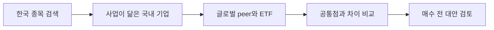
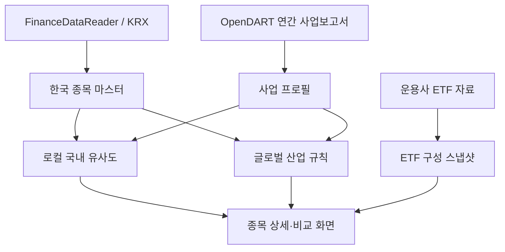

<div align="center">

# BEFORE BUY

### 이 종목을 사기 전, 다른 선택지도 보셨나요?

관심 있는 한국 종목을 입력하면 사업이 닮은 국내외 기업과 관련 ETF를 찾아<br>
**왜 비교할 만한지, 무엇이 다른지** 보여주는 투자 대안 탐색 서비스입니다.

<p>
  
  
  
</p>

</div>


## 어떤 문제를 해결하나요?

한 종목에 관심이 생기면 보통 그 기업의 차트와 재무지표부터 확인합니다. 하지만
매수하기 전에는 한 가지 질문을 더 해볼 필요가 있습니다.

> 이 기업을 꼭 사야 할까? 같은 산업에서 더 적합한 기업이나 ETF는 없을까?

기존 종목 화면은 선택한 기업을 자세히 설명하는 데 집중합니다. BEFORE BUY는
시선을 선택한 기업 바깥으로 돌립니다.

- 같은 사업을 하는 국내 기업은 무엇인지
- 비슷해 보이지만 수익 구조가 다른 글로벌 기업은 무엇인지
- 개별 기업 위험을 관련 ETF로 분산할 수 있는지
- 대안 사이의 사업 구조, 성장성, 주주환원, 위험은 어떻게 다른지

BEFORE BUY는 어느 종목이 더 좋다고 판정하지 않습니다. 사용자가 매수 전에
비교할 후보와 근거를 확보하도록 돕습니다.

## 이렇게 사용합니다

예를 들어 **삼성전자**를 검색하면 다음 선택지를 한 화면에서 검토할 수 있습니다.

| 비교 대상 | 함께 보는 이유 | 결정 전 확인할 차이 |
| --- | --- | --- |
| SK하이닉스 | DRAM·NAND와 AI 메모리 업황을 공유 | 삼성전자는 모바일·가전·파운드리로 더 분산됨 |
| 마이크론 | 미국 상장 메모리 반도체 기업 | 메모리 집중도, 주주환원, 달러 노출이 다름 |
| TSMC | AI 반도체 수요와 대규모 설비투자에 노출 | 메모리가 아닌 순수 파운드리 구조 |
| KODEX 반도체 | 국내 반도체 생태계에 분산 투자 | 단일 기업 대신 여러 기업의 위험을 함께 보유 |
| SOXX | 글로벌 반도체 설계·제조·장비에 분산 | 미국 기술주와 환율 위험이 추가됨 |

사용자는 최대 4개의 대안을 선택해 관심 종목과 나란히 비교할 수 있습니다.



## 누구를 위한 서비스인가요?

- 관심 종목에 대한 기본 지식은 있지만 비교 대상을 찾기 어려운 투자자
- 단기 매매 신호보다 사업 구조와 장기 위험을 비교하려는 투자자
- 개별 종목과 ETF 중 어떤 투자 단위가 적합한지 고민하는 투자자
- 국내 종목을 미국 글로벌 기업까지 확장해 보고 싶은 투자자

다음 용도를 목표로 하지 않습니다.

- 매수·매도 시점 예측
- 목표주가나 자동 매매 신호 제공
- 실시간 뉴스·공시 알림
- 수익률만으로 종목 순위를 매기는 서비스

## 서비스가 제공하는 것

### 1. 한국 상장 종목 전체 검색

KOSPI·KOSDAQ·KONEX 종목을 이름이나 종목코드로 검색합니다. 입력은 한국 상장
개별 종목에 집중하지만, 비교 후보에는 국내 기업·미국 글로벌 기업·국내외 ETF가
함께 포함됩니다.

### 2. 사업이 닮은 국내 기업

DART 연간 사업보고서와 KRX 주요 제품을 사용해 국내 유사 종목을 계산합니다.
각 후보에는 전체 점수만 보여주는 대신 다음 근거를 함께 표시합니다.

- 공통 사업 노출
- 공통 제품 키워드
- 사업 본문 유사도
- 기업 규모 차이
- 근거가 부족한 경우 `비교 근거 제한적` 표시

### 3. 글로벌 peer와 관련 ETF

반도체, 모빌리티, 2차전지, 플랫폼, 헬스케어, 방산, 금융의 검토 가능한 규칙을
통과한 종목에만 글로벌 기업과 ETF를 연결합니다. 직접 비교할 해외 기업이
불명확하면 ETF만 제시하며, 모든 종목을 억지로 분류하지 않습니다.

### 4. 종목과 ETF 직접 비교

단일 기업과 산업 바스켓의 차이를 다음 기준으로 확인합니다.

- 선택 종목의 ETF 편입 여부와 확인 가능한 비중
- ETF 주요 구성 종목과 전체 구성 수
- 단일 기업 위험과 ETF 집중 위험
- 핵심 사업 노출과 추가 확인 위험
- 수익률, 변동성, 최대 낙폭
- 미국 자산의 원화 환산 수익률과 환율 기준일

### 5. 산업 관계 맵

검색할 종목을 정하지 못한 경우 `섹터 → 세부 산업 → 기업·ETF` 순서로 탐색할
수 있습니다. 가격 상관관계가 아니라 사용자가 이해할 수 있는 사업 관계를
우선합니다.

## 추천은 어떻게 만드나요?

외부 LLM이나 유료 AI API를 호출하지 않습니다. 배치로 저장한 정형 데이터와
로컬 TF-IDF 계산을 사용하므로 같은 입력에서 같은 결과를 재현할 수 있습니다.

```text
국내 유사도 = 연간 사업보고서 텍스트 40%
             + 다중 사업 노출 40%
             + KRX 주요 제품 10%
             + 기업 규모 10%
```

- KRX 단일 업종의 완전 일치 여부를 0점/1점으로 사용하지 않습니다.
- 사업보고서와 주요 제품에서 반도체, 배터리 셀·소재·장비, 통신 서비스 등
  여러 사업 노출을 추출합니다.
- 제품·본문·사업 노출 중 어떤 근거로 연결됐는지 화면에 공개합니다.
- 대표 종목은 사람이 이해할 수 있는 예상 peer가 유지되는지 회귀 테스트합니다.
- 글로벌 연결은 임베딩 순위가 아니라 검토 가능한 산업 규칙을 사용합니다.

연간 사업보고서는 실시간 정보는 아니지만 기업의 핵심 사업 구조를 비교하기에는
변화가 비교적 느리고, 모든 기업에 동일한 기준을 적용할 수 있다는 장점이 있습니다.
최신성 한계는 보고서 기간과 접수일을 화면에 표시해 공개합니다.

## 현재 제공 범위

| 항목 | 범위 |
| --- | ---: |
| 검색 가능한 한국 상장 종목 | 2,872개 |
| DART 기업 고유번호 매핑 | 2,759개 |
| 연간 사업 프로필 | 2,739개 |
| 국내 유사도 계산 대상 | 2,650개 |
| 글로벌 peer·ETF 규칙 연결 | 500개 종목 |
| 큐레이션된 고급 비교 자산 | 48개 |
| ETF 구성 데이터 | 국내 7개·미국 7개 |

모든 종목은 검색할 수 있지만 데이터 상태에 따라 제공 범위가 다릅니다.

- 사업보고서가 확보된 종목: 국내 유사 종목 제공
- 글로벌 규칙을 통과한 종목: 글로벌 peer와 ETF 제공
- 큐레이션 대표 종목: 밸류에이션·성과·위험을 포함한 고급 대시보드 제공
- 보고서가 없거나 스팩·펀드인 종목: 제공할 수 없는 이유를 명시

## 데이터와 신뢰성



웹 요청마다 외부 API를 호출하지 않고, 로컬 배치가 생성한 버전 관리 가능한
스냅샷을 읽습니다.

- 최신 연간 사업보고서와 기재정정 보고서 선택
- 성공한 DART 결과는 재사용하고 갱신 실패 시 이전 정상본 보존
- 임시 파일 작성 후 원자적으로 스냅샷 교체
- API 키와 DART 전체 원문은 GitHub 및 배포 파일에서 제외
- 종목·프로필·유사도·ETF 사이 참조 무결성을 CI에서 전수 검사

현재 비교 대시보드의 밸류에이션·성과·위험 지표는 화면 구조 검증을 위한
**큐레이션 참고값**입니다. 실시간 시세나 자동 갱신값으로 표시하지 않으며,
실제 투자 판단 전 거래소·운용사·기업 공시에서 최신 값을 확인해야 합니다.

## 로컬 실행

Node.js 22.13 이상, Python 3.11 이상, [uv](https://docs.astral.sh/uv/)가
필요합니다.

```bash
git clone https://github.com/spark142857142857/BeforeBuy.git
cd BeforeBuy
npm install
uv sync
npm run dev
```

브라우저에서 [http://localhost:3000](http://localhost:3000)을 엽니다. 저장된
스냅샷이 포함되어 있으므로 API 키 없이 서비스를 실행할 수 있습니다.

DART 데이터를 새로 수집할 때만 `.env.local`에 키가 필요합니다.

```dotenv
NEXT_PUBLIC_SITE_URL=http://localhost:3000
DART_API_KEY=your_open_dart_api_key
```

`.env.local`은 Git에서 제외되며 키는 생성 데이터에 포함되지 않습니다.

## 주요 데이터 명령어

| 명령어 | 설명 |
| --- | --- |
| `npm run data:krx` | 한국 상장 종목 마스터 갱신 |
| `npm run data:dart` | DART 연간 사업 내용 수집·이어받기 |
| `npm run data:derive` | 프로필·국내 유사도·글로벌 연결 재생성 |
| `npm run data:refresh` | KRX부터 전체 파이프라인 갱신 |
| `npm run data:check` | 스냅샷과 데이터 참조 무결성 검사 |

세부 수집 절차는 [pipeline/README.md](./pipeline/README.md)에서 확인할 수 있습니다.

## 테스트

```bash
npm run lint
npm run test:use-cases
npm test
```

현재 Node 테스트 22개와 Python 테스트 31개를 실행하며 GitHub Actions에서도
같은 검증을 수행합니다.

- 한국 종목 검색, 상세 URL, 키보드 탐색
- 대표 매수 전 비교 사용 사례
- 유사도 자기 추천·중복·점수 범위·근거 강도 전수 검사
- 삼성전자·LG에너지솔루션·JYP·에코프로 등 대표 peer 회귀
- 우선주 프로필 연결과 스팩 제외
- KOSDAQ GLOBAL 시장 정규화
- DART 캐시 복구와 갱신 실패 처리
- 원자적 스냅샷 교체와 이전 정상본 보존
- ETF 구성·기준일·출처와 미국 ETF 원화 환산

## 기술 구성

| 영역 | 기술 |
| --- | --- |
| Web | Next.js 16, React 19, TypeScript, CSS |
| Build | Vinext, Vite |
| Data pipeline | Python 3.11+, uv, pandas |
| Similarity | scikit-learn, TF-IDF, cosine similarity |
| Data | FinanceDataReader/KRX, OpenDART, ETF 운용사 자료 |
| Test | Node test runner, Python unittest, GitHub Actions |

```text
app/                    검색·상세·비교 화면과 API
components/             검색·국내 peer·글로벌 peer·ETF UI
lib/data/               큐레이션 데이터와 조회 계층
data/generated/         배포용 데이터 스냅샷
pipeline/               KRX·DART 수집과 유사도 계산
scripts/check-snapshot.mjs  데이터 전수 무결성 검사
tests/                  웹 경로와 사용 사례 테스트
```

## 다음 단계

현재는 기능을 늘리기보다 실제 종목을 검색하며 유사도 품질과 비교 경험을 개선하는
단계입니다.

1. 여러 산업의 대표 종목을 사용하며 잘못된 peer와 부족한 근거 보완
2. 큐레이션 참고 지표를 신뢰할 수 있는 시장 데이터 공급자로 교체
3. 모바일·비교표·데이터 공백 안내 UI 개선
4. 기능과 데이터 품질이 안정된 이후 웹 배포
5. 이후 종목 주변의 기업·ETF 관계를 거리로 표현하는 사업 관계 그래프 검토

## 주의 사항

이 프로젝트는 투자 권유, 종목 추천, 목표주가 또는 자동 매매 신호를 제공하지
않습니다. 표시 데이터는 지연되거나 오류가 있을 수 있으며 실제 투자 판단 전에는
원문 공시와 공식 데이터를 다시 확인해야 합니다.
